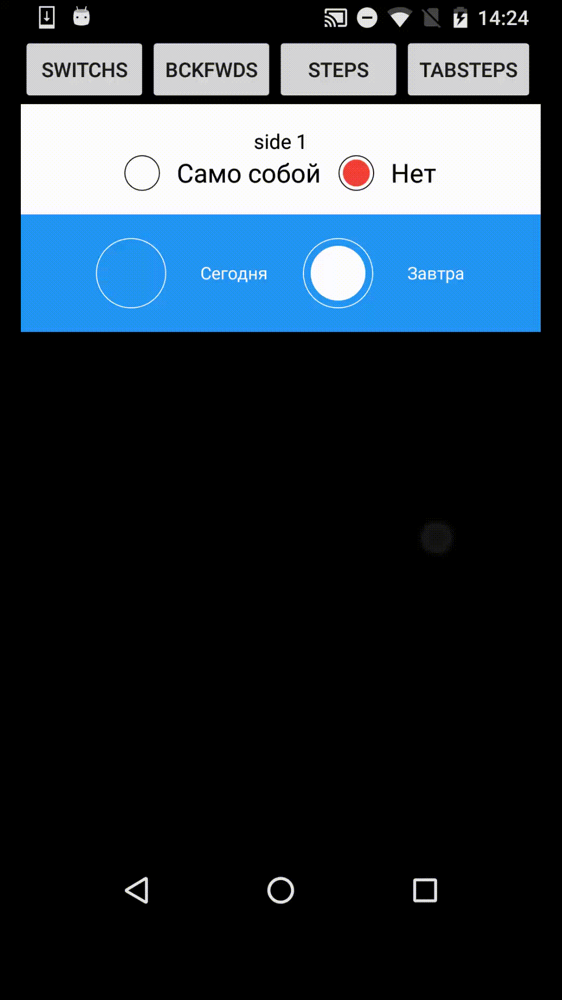
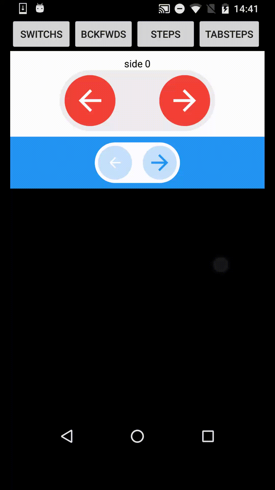
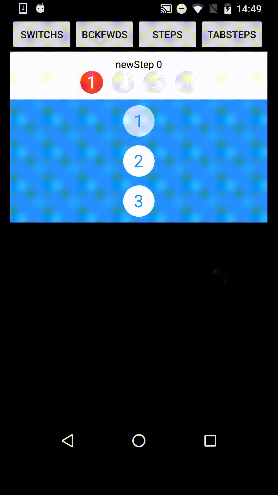
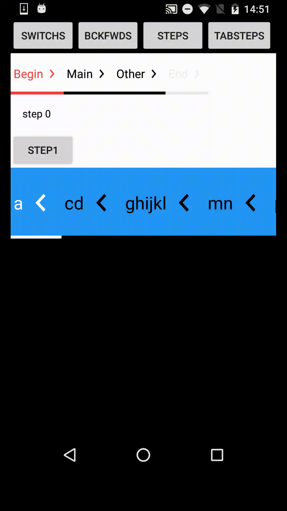

   

# RedGreyControlsCollection
RedGrey design controls collection

## Samples

- [Switch](https://github.com/StanleyDevelop/RedGreyControlsCollection/blob/master/java/stan/rgcc/demo/ui/views/Switch.java)

- [BackForward](https://github.com/StanleyDevelop/RedGreyControlsCollection/blob/master/java/stan/rgcc/demo/ui/views/BackForward.java)

- [Steps](https://github.com/StanleyDevelop/RedGreyControlsCollection/blob/master/java/stan/rgcc/demo/ui/views/Steps.java)

- [TabSteps](https://github.com/StanleyDevelop/RedGreyControlsCollection/blob/master/java/stan/rgcc/demo/ui/views/TabSteps.java)

# Build information
## defaultConfig
	applicationId "stan.rgcc.demo"
	versionCode 1706231908
	versionName "0.018"
## dependencies
## gradle
    2.2.2